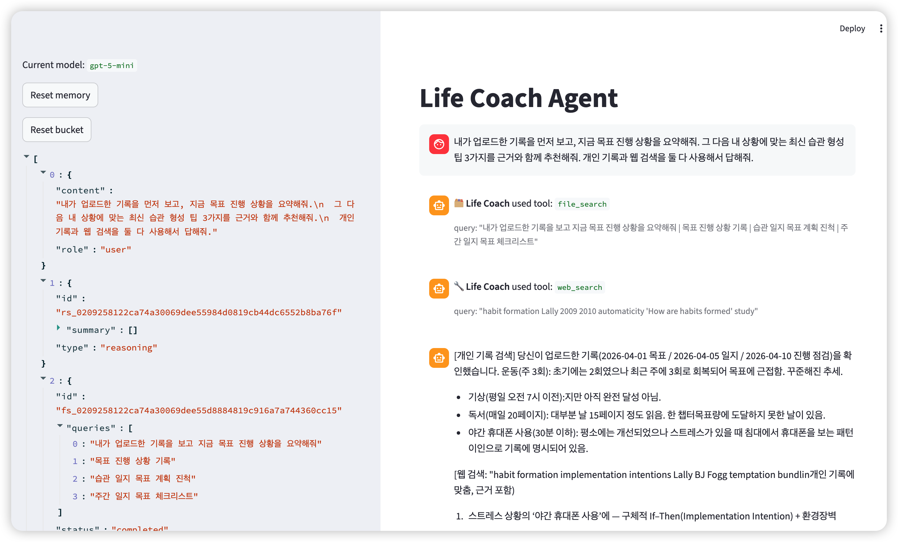

# Life Coach Agent v2

간단한 라이프 코치형 AI agent 실습용 Streamlit 앱입니다.

OpenAI Agents SDK 기반으로 대화 메모리를 유지하고, 필요할 때 웹 검색과 파일 검색을 함께 사용해 더 개인화된 코칭 답변을 제공합니다.



## 주요 기능

- 채팅 폼으로 대화하기
- input bar의 파일 피커로 `TXT/PDF` 파일 업로드 지원
- `gpt-5-mini` 기반 라이프 코치 페르소나
- OpenAI Agents SDK의 `SQLiteSession`으로 세션 메모리 유지
- OpenAI `files.create` / `vector_stores.files.create` 기반 파일 업로드
- OpenAI `vector store`의 기존 store 재사용
- `FileSearchTool`로 업로드한 목표 문서/일지/루틴 검색
- `WebSearchTool`을 활용한 코칭 관련 웹 검색
- 파일 검색/웹 검색 사용 시 채팅 화면에 tool 사용 표시
- Streamlit 기반 단일 페이지 UI

## 프로젝트 구조

```text
.
├── docs/images/실행화면-v2.png
├── main.py
├── pyproject.toml
└── uv.lock
```

## 실행

```bash
uv sync
cp .env.example .env
uv run streamlit run main.py
```

## 환경 변수

`.env` 파일에 아래 값을 넣으면 됩니다.

```bash
OPENAI_API_KEY=your-api-key-here
OPENAI_VECTOR_STORE_ID=optional-existing-vector-store-id
```

## 메모리

- 대화 메모리는 로컬 파일 `life_coach_memory.db`에 저장됩니다.
- 업로드된 파일 본문과 검색 인덱스는 OpenAI Files / Vector Store에 저장됩니다.
- `OPENAI_VECTOR_STORE_ID`가 있어야 파일 업로드와 파일 검색이 동작합니다.

## 참고

- 주제가 라이프 코칭 범위를 벗어나면 답변을 거절하도록 페르소나를 제한했습니다.
- 목표, 일지, 루틴, 진행 상황 질문은 업로드된 파일을 먼저 검색하도록 설정했습니다.
- 코칭 관련 질문은 필요 시 웹 검색을 추가로 사용하도록 설정했습니다.
